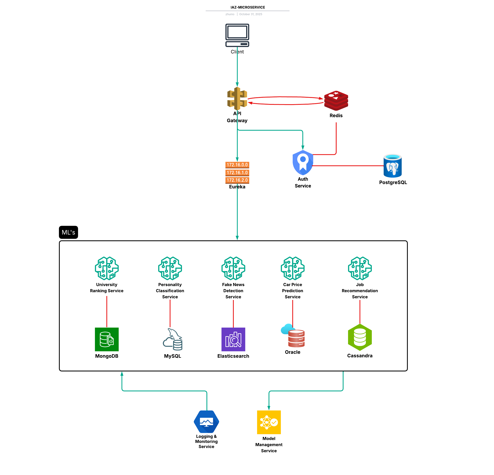

# MICROSERVICE IAZ

> Sistema completo con la arquitectura de microservicios que integra 5 modelos de Machine Learning con arquitectura empresarial, service discovery, API Gateway y seguridad JWT.

## Tabla de contenidos
- [Descripcion General](#descripción-general)
- [Características Principales](#-características-principales)
- [Arquitectura del Sistema](#arquitectura-del-sistema)
- [Tecnologías Utilizadas](#-tecnologías-utilizadas)
- [Microservicios](#-microservicios)
- [Requisitos Previos](#-requisitos-previos)
- [Instalación](#-instalación)
- [Configuración](#️-configuración)
- [Uso](#-uso)
- [Endpoints Principales](#-endpoints-principales)
- [Bases de Datos](#bases-de-datos)
- [Documentación](#-documentación)
- [Roadmap](#-roadmap)
- [Contribuir](#-contribuir)
- [Licencia](#-licencia)
- [Autor](#-autor)

---

## Descripción general
Esta plataforma demuestra el dominio completo de arquitectura de microservicios empresarial, integrando múltiples lenguajes (Java y Python), diversas bases de datos (3 SQL + 5 NoSQL), y aplicando Machine Learning en escenarios reales de producción.

## Arquitectura del sistema

## Bases de datos
### Auth Service
